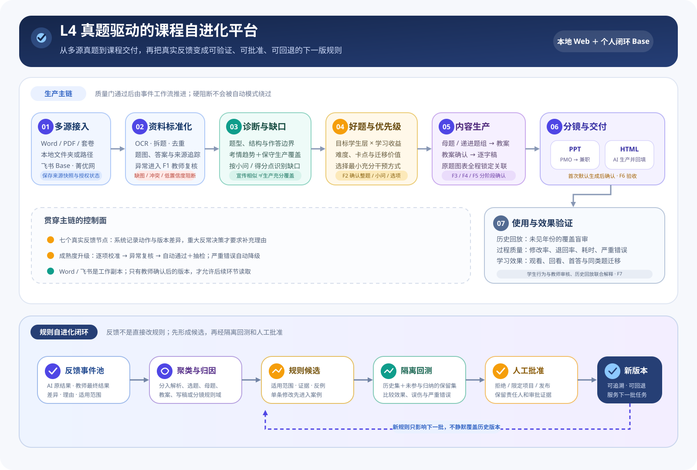
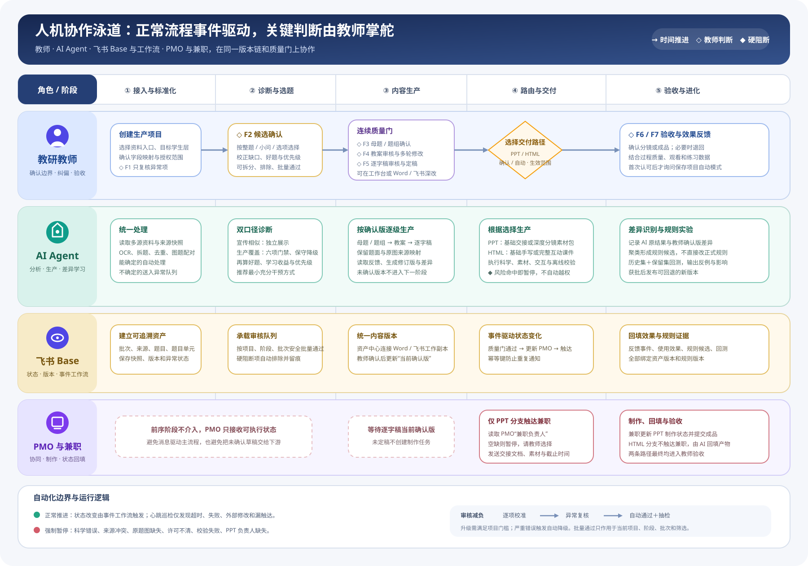
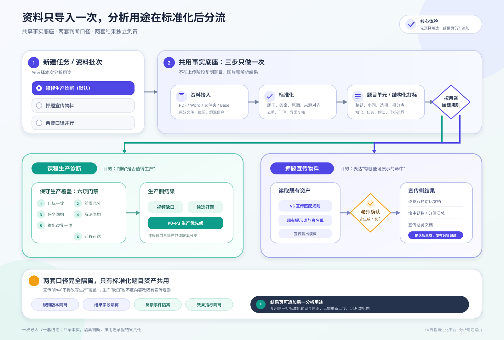
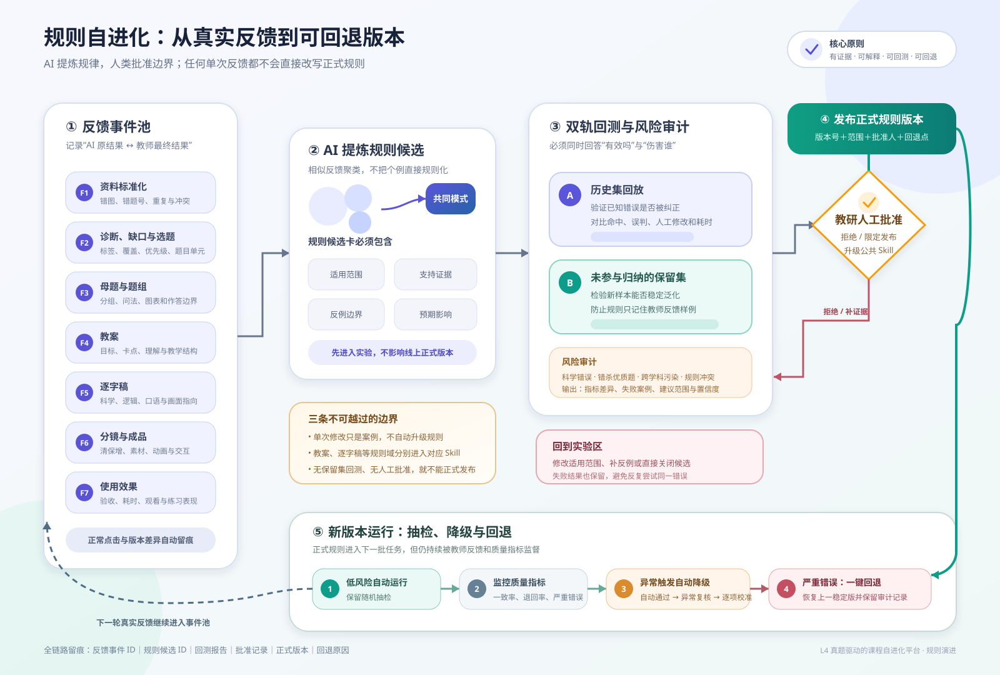
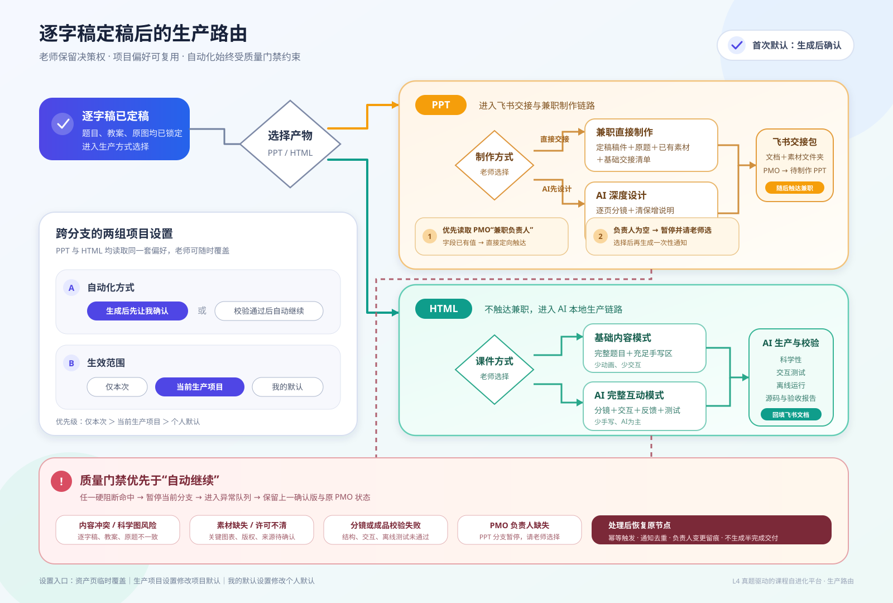
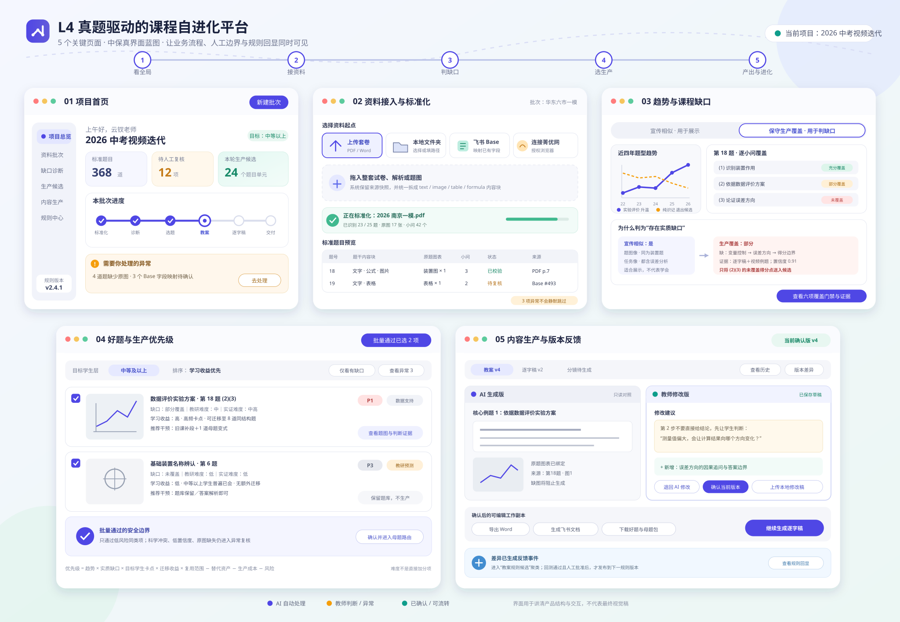
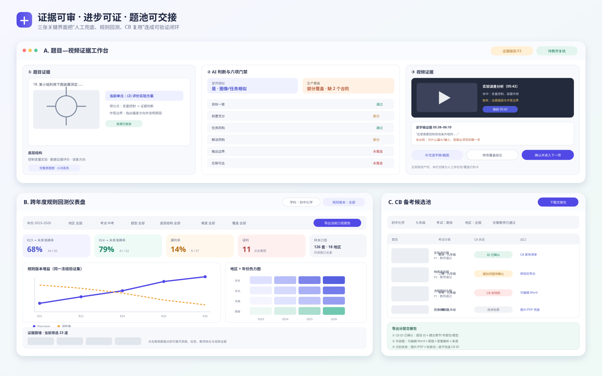
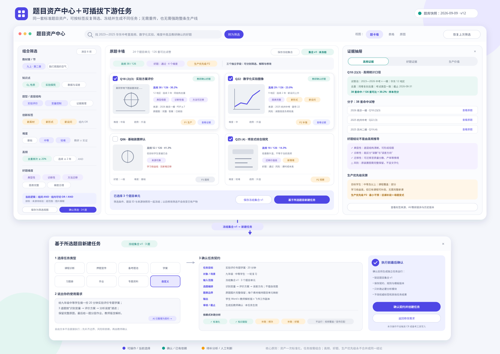

# L4 考情驱动课程自进化平台设计规格

- 状态：需求边界已确认，补充题目资产中心、可插拔任务、高频/好题证据与 V5/V6 宣传规则继承
- 日期：2026-09-09
- 参赛主线：中考题分析 → 视频诊断与选题 → 教研内容生产 → PPT/HTML 交付 → 反馈回写 → 规则回测与升级
- 产品形态：本地 Web；每位使用者复制自己的闭环 Base；GitHub 只保存代码、模板、规则版本和脱敏样例
- 主要使用者：初中化学与初中物理教研、课程生产协作者、兼职 PPT 制作者、生产管理人员

## 1. 核心结论

平台不是一次性的试卷分析器，也不是把 AI 文本生成串成长链条。它把不同成熟度的试题资料统一成可追溯的题目资产，让 AI 完成诊断、候选筛选、教案、逐字稿和分镜等工作，让教师只在自己选择的节点确认或修正，再将最终差异沉淀为规则候选。项目内实验规则可自动生成、回测和进入下一轮；只有跨项目公共规则和公共 Skill 发布始终需要人工批准。

平台同时解决四件事：

1. **生产**：从多源试题到可交付的教案、逐字稿、PPT 交接包或互动 HTML。
2. **协作**：工作台、可编辑 Word、飞书文档和 PMO 多维表格在明确版本边界下协同。
3. **自进化**：教师反馈从逐项校准逐步减负为异常复核和自动通过加抽检；有效修改分别进入选题、教案、写稿和分镜规则域。
4. **验证与复用**：通过冻结规则版本、跨年度滚动回测和可交互仪表盘证明筛选规则是否真的进步，并把教师确认的好题沉淀为可下载、可对接 CB 的备考候选池。
5. **灵活应用**：标准化题目资产不是视频生产的中间废料。老师可从同一批题目继续创建学案、习题册、作业、专题资料或自定义任务，不必重传和重做基础分析。

**图 1｜平台全景闭环**



## 2. 用户问题

### 2.1 资料起点不一致

有的老师持有整套 Word/PDF 和解析，有的只有本地题目截图文件夹，有的已经在飞书 Base 中积累题目信息和截图，还有的希望平台帮助检索菁优网或公司 CB 题库。现有工作台要求同时上传真题 Word 和 PDF，无法覆盖这些起点。

### 2.2 人工判断重复且无法学习

题型、视频覆盖、好题、生产优先级、教案和逐字稿都需要教师判断，但反馈散落在消息、文档和口头沟通中；下一批任务无法稳定复用。

### 2.3 产物被强制绑在单一路径

已确认的好题、母题、教案或逐字稿本身都有独立使用价值。老师可能只想下载题目包，可能在工作台让 AI 修改，也可能下载 Word 或进入飞书深改，不应被迫走到 PPT 生产。

### 2.4 自动化容易越权

批量通过、外部题库采集、规则自更新、飞书覆盖和自动通知都可能提高效率，也可能放大科学错误、版权风险和版本冲突，因此需要明确的停止条件、版本和人工批准边界。

### 2.5 同一份试卷存在两种业务目的

大多数任务要保守判断课程缺口、生产价值与优先级；少数任务要按既有宣传规则制作押题对比物料。两者可以共用题目抽取、原题截图和结构化标签，但判断阈值、统计口径、审核动作和最终文档不同。若不在入口明确用途，宣传白名单容易污染课程缺口，生产结论也会让宣传物料错失既有的展示口径。

## 3. 产品目标与非目标

### 3.1 目标

- 接入成套文件、本地文件夹、飞书 Base 和授权外部题库等多种来源。
- 将所有来源统一为可追溯的标准题目资产，保留整题、小问、选项及其原题图表。
- 分开判断题目质量和当前生产优先级。
- 支持同一资料批次选择“课程生产诊断”“押题宣传物料”或“两套口径并行”，并保证规则、指标、反馈和输出互不污染。
- 支持教师按整题、小问、选项或组合确认生产候选。
- 支持母题整合、教案、逐字稿、分镜、PPT/HTML 生产及阶段性独立导出。
- 把教师真实决策和最终修改转成结构化反馈，但不要求每次重写理由。
- 通过规则候选、保留集回测、项目内自动迭代、公共规则人工批准和可回退版本形成可验证的自进化闭环。
- 通过跨年度滚动回测、地区/年份/题型分析和证据下钻，量化“符合考试趋势的好题”规则是否改善。
- 将教师确认的高频好题按学科、年级和考试类型沉淀为备考候选池；保留 CB 题目 ID，并为外部题生成可编辑交接包。
- 通过本地运行、个人 Base 和脱敏 GitHub 仓库保护真实题目、内部视频和账号数据。

### 3.2 非目标

- 不把备考工具自动上线并入首个参赛 MVP；只保留可验证的候选题输出接口。
- 不允许单条反馈直接修改正式规则或全局 Skill。
- 不建立未经授权的第三方题库批量爬虫，不绕过验证码、付费或访问限制。
- 不让 Word、飞书和本地平台三方无确认地实时互相覆盖。
- 不用生成式图片猜画原题装置、坐标、数据、比例和科学关系。
- 不以一次中考押题命中作为当年唯一成效证据。
- 不把宣传命中率解释为学生学会率、课程充分覆盖率或生产诊断结论。

## 4. 关键术语

| 术语 | 定义 |
|---|---|
| 生产项目 | 一批具有共同目标、学科、规则和 PMO 配置的任务，如“2026 中考视频迭代” |
| 资料批次 | 一次导入的一组来源，可同时包含文件、文件夹和 Base |
| 标准题目资产 | 统一结构的题目记录，包含来源、题干内容块、图表、小问、选项、答案和版本 |
| 题目单元 | 可独立判断和进入生产的最小单位：整题、小问、选项或其组合 |
| 好题 | 题目本身具有结构完整、证据可靠、典型和可迁移等质量 |
| 高频 | 在明确试卷池、时间、地区、考试类型和去重口径下，某一底层结构或题目单元出现得多；必须同时显示分子、分母和样本范围 |
| 来源地区 | 被用于分析和选题的试卷所在地区，保留省—市—区县—学校及考试组织范围 |
| 目标地区 | 本次备考包、视频清单或分析报告面向的地区；可与来源地区不同 |
| 生产优先级 | 结合考试趋势、课程缺口、学生需求、复用范围、成本和风险得到的当期生产顺序 |
| 视频存在性 | 课程库中是否存在候选视频，只回答“有没有可查的视频”，不代表已覆盖题型 |
| 生产覆盖 | 有证据证明学生完成视频学习后，是否能完成对应题目单元及必要得分点 |
| 预测批次 | 在未来年份试题进入系统前冻结的规则版本、数据窗口、候选集合和发布时间 |
| 印证 | 后续试题与预测题型具有共同底层结构、任务、解法和作答边界；仅知识点相同不算印证 |
| 分析用途 | 本批次要解决的业务任务：课程生产诊断、押题宣传物料或两套口径并行 |
| 下游任务 | 基于冻结题目资产创建的一次独立使用，如视频生产、备考题池、学案、习题册、作业、专题资料或教师自定义任务 |
| 题目集合 | 由筛选条件和具体题目单元共同冻结的可复用快照；后续任务读取集合版本，而不是读取会变化的实时筛选结果 |
| 宣传命中 | 按已批准的宣传版规则与白名单，允许进入押题对比物料的题目—视频关系；不同于生产覆盖 |
| 当前确认版 | 被教师明确确认、允许后续环节读取的正式版本 |
| 反馈事件 | AI 原结果、教师动作、最终结果、差异、理由、规则版本和适用范围的记录 |
| 规则候选 | 从多条有效反馈中归纳、尚未进入正式生产的规则修改建议 |
| 回写 | 把有效反馈形成规则候选；不同于恢复旧版本的“回滚” |

## 5. 角色与责任

| 角色 | 主要责任 |
|---|---|
| 教研教师 | 确认题目结构、诊断、候选、母题、教案、逐字稿和科学边界 |
| AI Agent | 导入、标准化、分析、生产、差异识别、规则候选生成和回测 |
| 项目负责人 | 配置生产项目、规则版本、自动化成熟度和发布门槛 |
| 兼职 PPT 制作者 | 按飞书交接文档和素材文件夹完成 PPT |
| 生产管理 | 维护 PMO 状态、负责人和异常协同 |
| 规则批准人 | 审核回测证据，决定发布、限定范围或拒绝规则候选 |

## 6. 端到端流程

```text
00 选择首个任务（生产诊断/押题宣传/备考题池/教学资料/自定义）
→ 01 多源资料接入（文件/文件夹/Base/菁优网/CB）
→ 02 共用标准化、拆题、去重与来源追踪
→ F1 标准化异常复核
→ 03 题型、底层结构、设问与作答边界打标
→ 按分析用途分流

生产分支：04 考情趋势与视频覆盖缺口诊断
→ 05 好题判断和生产优先级判断
→ F2 教师按整题/小问/选项确认
→ 06 已确认生产候选池
→ 07 母题整合或递进题组路由
→ F3 母题审核
→ 08 教案生成
→ F4 教案审核与多轮修改
→ 09 逐字稿生成
→ F5 逐字稿审核与多轮修改
→ 10 选择 PPT/HTML、生产方式、审核方式和生效范围
→ 11 分镜、素材及成品生产
→ F6 分镜或成品验收
→ 12 使用与效果数据、跨年度回测与交互仪表盘
→ F7 效果反馈

宣传分支：宣传候选与白名单 → F2P 教师宣传终审
→ 逐卷题目—视频双栏对比文档 → 宣传命中题数/分值汇总
→ 宣传总览文档与可编辑工作副本

教师确认的好题/高频题 → 按学科、年级、考试类型聚类
→ CB 题目 ID 核验 → 备考候选池 → Word/清单/图片包下载

任一冻结题目集合 → 新建下游任务
→ 学案/习题册/作业/专题资料/自定义产物
→ 任务契约确认 → 生成、审核、下载或继续复用

F1～F7 → 反馈事件池 → 分规则域聚类 → 规则候选
→ 历史集与保留集回测 → 项目内实验版本自动进入下一轮
→ 达到项目门槛后按预授权升级项目正式版本
→ 跨项目公共规则/公共 Skill 人工批准
```

每个阶段只有在所需质量门通过后才触发下一环节。任何自动模式都不能绕过严重科学错误、来源冲突、素材许可、原题图缺失和系统校验失败。

**图 2｜教师、AI、飞书工作流与生产协作者泳道图**



## 7. 多源资料接入

### 7.1 入口设计

“新建资料批次”允许同时选择多个来源：

- 上传成套试卷：Word、PDF、官方解析，解析可选；
- 上传若干本地文件；
- 选择本地文件夹；
- 输入本地文件夹绝对路径；
- 输入飞书 Base 地址，选择表和视图并映射字段；
- 粘贴一个或多个试卷网页链接；
- 连接菁优网；
- 连接公司 CB 后台，或导入 CB 已下载的试卷/题目清单。

用户先填写批次名称、学科、年级、地区、年份和考试类型。不同来源可在同一批次合并，不能因某个来源失败而丢弃其他已成功来源。

### 7.2 首个任务与分析用途路由

“新建任务”第一步先选要完成的业务任务。首屏将常用任务分成三组：

- **分析与课程**：课程生产诊断（默认）、押题宣传物料、两套口径并行；
- **题目使用**：备考候选池、学案、习题册、作业、专题资料；
- **其他需求**：自定义任务。

其中课程分析仍使用三张主卡：

1. **课程生产诊断（默认）**：使用保守生产覆盖规则，输出视频缺口、好题、生产优先级和最小干预方式；
2. **押题宣传物料**：使用已批准的宣传匹配规则和既有输出模板，输出宣传候选、逐卷对比文档与汇总；
3. **两套口径并行**：只做一次导入和标准化，随后分别运行生产与宣传规则。

选择保存在首个下游任务上，可继承生产项目默认值。老师可在分析开始前修改；已经生成结果后，不能把原结果原地改成另一口径，但可点击“基于本批题目新建任务”，从同一冻结题目资产创建新的分析或生产运行，无需重新上传。每次运行保存独立的用途、规则版本、输入快照、教师结论和输出链接。

用途路由不应放在视频匹配结果之后才第一次出现，因为老师在任务开始时需要知道会得到什么产物；也不应放在文件上传控件内部，因为同一批次可含多个来源。最合适的位置是“新建任务 → 基本信息与分析用途 → 添加资料来源”。上传页顶部持续显示用途标签，并允许在正式分析前切换。

#### 7.2.1 可插拔下游任务

标准化完成后，资产中心始终显示“基于本批题目新建任务”。预置模板包括课程诊断、宣传、备考题池、学案、习题册、作业和专题资料；老师也可输入其他需求。系统不会直接把一句自由文本交给生成模型，而是先将需求整理为可确认的“任务契约”：

- 目标、使用对象和教学场景；
- 题目范围或题目集合、知识范围和排除条件；
- 题量、题型、难度/梯度、高频/好题要求和答案解析要求；
- 选题与编排规则、是否允许改编、原题图表保留要求；
- 输出结构、下载格式、审核节点和截止条件；
- 需要补跑的分析模块及其规则版本。

任务契约按当前项目的教师介入策略放行：可设置为自动执行、只看异常或生成后确认，不把人工确认设为所有项目的硬前提。自定义任务默认只读取标准题目资产并生成新产物，不改动权威标签；事实性纠错可进入标准化反馈，个人编排偏好只沉淀到该任务模板或当前生产项目。

题目进入下游时保存三套互相独立的判断：`当前视频/课程去向`、`题目角色`与`可用场景`。题目角色允许多选母题候选、核心例题、同构练习、变式练习、迁移练习、检测题和基础巩固题；可用场景允许同时选择视频生产、习题册、作业、学案、专题资料和备考题池。同一道题可以既是高频好题，又同时进入视频与习题册；课程 P1/P2/P3 不能充当题目的通用价值等级。

平台采用依赖式运行：学案、作业等通常需要标准化、知识/题型、难度、好题和频次，不必强制运行视频覆盖；课程生产才补跑趋势、覆盖和优先级；宣传任务只补跑宣传匹配。这样既复用底层资产，又不把所有老师拖进完整生产线。

**图 7｜分析用途选择与生产/宣传双分支**



### 7.3 来源快照

每个来源保存：来源类型、原始位置、导入时间、导入人、文件指纹或远端记录 ID、字段映射、授权/复用状态和本次快照。后续来源更新时生成新快照，不静默覆盖旧批次。

### 7.4 统一题目结构

标准题目至少包括：

- 题目 ID、来源 ID、试卷和题号；
- 来源系统、来源试卷 ID、来源题目 ID；来源为 CB 时分别保存 `cb_paper_id` 和 `cb_question_id`，不得推测或伪造；
- 学科、年级、地区、年份和考试类型；
- 规范省、市、区县、学校、考试组织范围及原始地区名称；
- 考试大类、考试序次、标准考试类型、原始考试名称和考试时间；
- 题干内容块及顺序；
- 原题图片、装置图、坐标图、流程图和表格；
- 小问、选项及其与素材的对应关系；
- 答案、解析、分值及置信度；
- 文件指纹、重复组和冲突状态；
- 当前版本和审核状态。

题干不是纯文本字段，而是按顺序保存的 `text / image / table / formula` 内容块。

### 7.5 标准化异常队列

系统自动处理可确定内容；以下项目进入 F1：题号冲突、截图与题干无法配对、答案不一致、OCR 置信度低、图片模糊、疑似重复但无法自动合并、Base 字段缺失。

### 7.6 既有全国中考真题 Base 的继承方式

本次核验的 Base（现名“中考真题筛选中考化学全国各地近5年”，token `NbJUbaSz2aaqiGsP84Zc0Py6nHd`）包含 16 张表；其中 `google AI studio2025中考（复核√）` 有 1556 条题目、25 个字段，已经沉淀题目截图、题型、知识点、章/大节/小节、新素材、新形式、新设问、难度、应用场景和教研好题等标签。平台应将它作为权威来源和标签字典之一，但不建议每位老师完整复制这个业务库：库内同时存在历史表、试验表和停用表，整库复制会把旧流程与重复字段一并扩散。

迁移采用“干净闭环 Base 模板＋来源适配器＋标签字典快照”：

1. 保留原记录 ID、原表/视图、来源版本和全部原始标签，不静默改写；
2. 将章—大节—小节、197 个知识点选项及 `新素材/新形式/新设问/能力分层题型` 选项同步为带版本的标签字典；
3. 将 `好题`、`教研判定好题`、`做视频入选`、`是否已做视频` 分别映射为“历史 AI/初筛结论、历史教研结论、历史生产决策、视频存在性”，不合并成一个结论；
4. 新平台的高频、好题、生产优先级、视频覆盖另建规范字段，并记录模型结论、教师结论、证据、置信度和规则版本；
5. 老师可在工作台直接筛选既有标签，也可保存为题目集合后下载或创建下游任务。

核验样本已经出现 `好题=是`、`教研判定好题=不符合` 的真实分歧，证明原始字段必须保留语义和来源，不能用“最后一个非空值”覆盖。

核验时（2026-09-09），用户给出的具体视图带有三项 AND 筛选：`教研判定好题=是`、`应用场景=重难点培优`、`章=8-金属和金属材料`。导入时必须让老师明确选择“仅导入当前视图”或“导入整张表”，并在预览中显示预计记录数和筛选条件，避免把一个局部视图误当成全国全量题库。

## 8. 菁优网接入

### 8.1 正式方案

正式规模化优先使用菁优网资源开放平台/API，在机构授权、合同和调用范围明确后实现稳定数据接口。实现前记录可用字段、使用限制、费用、缓存和二次加工范围。

### 8.2 比赛期间小规模方案

老师点击“连接菁优网”，系统打开受控浏览器，老师本人扫码或登录。平台不保存账号密码和长期凭证。老师输入学科、地区、年份、考试类型、关键词和数量要求；AI 先展示候选试卷，老师确认具体试卷后，AI 才在当前会话逐题浏览、截图并保存来源信息。

采集遵循：不绕过验证码或付费限制、不扩张到未确认试卷、串行限速、允许随时停止、不上传 GitHub、保留来源链接和采集时间。若授权或页面限制不允许继续，退回链接或官方导出文件导入。

### 8.3 采集结果

每道题保存试卷名称、试题/试卷 ID、原始链接、题号、完整题图、必要分段截图、页面元数据、采集时间和文件指纹，然后进入与其他来源相同的标准化流程。

### 8.4 CB 后台接入与授权边界

现有 CB 资产表明：CB 同时管理课程、习题、试卷和备考工具；习题支持单题或 Word 批量导入；备考工具按“章节—专题包—题型”组织，并通过习题 ID 关联题目，关联视频可选。因此平台不能把“从网页拿到题图”和“已经能进入备考工具”视为同一件事。

CB 接入按三层实现：

1. **正式目标：官方 API 或官方导出接口。**确认权限、字段、频率、增量更新、写入审批和题目使用边界后，建立稳定适配器。
2. **比赛验证：老师授权的浏览器会话。**老师本人扫码登录，指定学科、年级、考试类型、地区、年份和关键词；AI 先展示候选试卷/题目，教师确认后再搜索、打开、下载或截图。平台不保存密码和长期登录态，不绕过权限或验证码。
3. **文件兜底：CB 导出文件、Word、Excel、PDF 或截图。**无法自动访问时仍进入统一标准化流程，并保留“来源待核验”。

CB 导入至少保存：`cb_paper_id`、`cb_question_id`、CB 题目预览/链接、版本、检索条件、获取时间和操作人。若题目来自外部，平台先在教师授权范围内检索 CB，按以下顺序判断是否为同题：

- CB ID 精确一致；
- 规范化题干、选项顺序、关键图表指纹和答案共同一致；
- 仅 OCR 文本相似、知识点相同或图片局部相似，只能标记“疑似同题”，必须人工确认；
- 未找到则标记“CB 待录入”，绝不生成虚假 ID。

CB 搜索结果只解决身份绑定和复用问题，不替代题目质量、趋势、课程覆盖与生产价值审核。

## 9. 题目诊断、好题与生产优先级

### 9.1 结构化打标

AI 给出知识板块、题型、底层结构、设问任务、作答边界、难度、情境、视觉形式和创新特征，并显示证据、置信度和所用规则版本。标签不是结论黑箱；教师能回到题干、小问或图表查看依据。

### 9.2 趋势与视频缺口

趋势输出包括升温、稳定、波动和退出候选及证据。视频匹配支持“宣传相似”和“生产覆盖”两套互不替代的结论：选择单一用途时只运行对应规则；选择“两套口径并行”时，从同一冻结题目资产分别运行。宣传相似用于展示既有课程与真题的相似点，生产覆盖用于判断学生看完课程后能否独立完成对应题目单元。课程缺口和生产优先级只读取生产覆盖结论，不读取宣传命中率。

#### 9.2.1 现有规则中可保留的部分

- 逐题阅读题干、答案和解析，并按整题、小问、选项拆分任务；
- 区分题型、设问任务、解法模型、图表/装置/流程等视觉形式；
- 曲线子类型、词根误配、只同章节、基础常识题等负向门禁；
- 复合题使用 `task_video_map` 记录不同小问与视频的对应关系；
- 候选、白名单、人工审核、来源图和规则版本均可追溯。

这些能力适合继续用于“寻找候选”和“宣传相似审计”，但不能直接证明课程已经覆盖了题型。

#### 9.2.2 现有规则需要调整的问题

1. “题图像、任务像、解法像”判断的是相似度，不是教学充分性；外观像或局部动作像，学生仍可能无法完成目标小问。
2. 复合题只命中一个锚点小问，或由多个视频分别碰到不同知识点时，不能把整题分值都计为已覆盖。
3. `promotion=allow`、人工白名单和 `final_show` 是展示决策，不得导入生产覆盖结论。
4. “第一眼一般”、同题型、同章节、同知识点、同素材、视频名/标签命中只能进入候选，不能成为充分覆盖证据。
5. 概念课讲到了知识点，不等于覆盖了该题型的设问逻辑、推理路径和作答边界；应标为“知识支撑”。
6. 多个互不衔接的视频的并集不能掩盖课程缺口；只有已在课程路径中明确编排、前置关系完整的视频组合，才可作为一个覆盖组合审核。
7. 缺少逐字稿、例题或课程目标证据时，不能判“充分覆盖”；不确定时向更保守状态降级。

#### 9.2.3 生产覆盖六项门禁

生产覆盖以“题目单元”为最小判断单位，逐项检查：

1. **目标一致**：视频教学目标与该小问/选项实际考查目标一致；
2. **前置充分**：完成任务所需概念、条件和前置方法已在本视频或已确认课程路径中提供；
3. **任务同构**：学生面对的输入信息和设问动作一致，而非只有题型名称相同；
4. **解法同构**：关键推理链、证据使用和操作步骤一致；
5. **输出边界一致**：答案形式、得分点、条件限制和常见易错边界得到覆盖；
6. **迁移可达**：视频包含足以支持该题迁移的例题、变式或明确方法，不要求学生跨越未教学的关键台阶。

“题图像”保留为候选召回和宣传展示证据，不再作为生产充分覆盖的必要或充分条件；无图的同构任务可以充分覆盖，有图但只外观相似的任务不能充分覆盖。

#### 9.2.4 生产覆盖状态与缺口口径

| 状态 | 判定 | 缺口处理 |
|---|---|---|
| 充分覆盖 | 单个视频或已确认的连续课程组合通过六项门禁，覆盖该题目单元全部必要得分点 | 不记缺口 |
| 组合支撑但缺综合迁移 | 多节课分别覆盖前置知识、单项原理或局部方法，但没有完成该综合任务所需的串联、完整解法和作答边界 | 仍记综合迁移缺口；根据考试价值和学生卡点判断是否增加真题串讲、短讲或完整课程 |
| 部分覆盖 | 只覆盖部分得分点、某个步骤或前置知识 | 只对未覆盖单元记缺口，可建议补讲或改造旧视频 |
| 知识支撑 | 讲到相关概念，但未覆盖该设问的任务、解法或作答边界 | 题型仍记缺口，可作为前置课程引用 |
| 邻近相似 | 同题型、同素材、同图表或同关键词，但关键任务/解法不同 | 记缺口 |
| 未覆盖 | 无可靠候选 | 记缺口 |
| 无法判断 | 逐字稿、例题、原题或解析证据不足 | 不计入已覆盖，进入人工复核/补资料队列 |

覆盖率按题目单元或得分点计算，不使用“只要整题存在一个匹配就计入整题分值”的算法。复合题同时展示整题汇总和逐小问结果；整题只有在所有必要单元充分覆盖时才显示“整题充分覆盖”。多个视频分别讲过公式、图像、概念或步骤，只能证明存在组合支撑；若缺少把这些内容用于同一综合任务的迁移台阶，不能合并判为充分覆盖。同一题—视频对可以同时是“宣传相似：是”和“生产覆盖：部分/邻近”，两套结论均保留且互不改写。

证据优先级为：定稿逐字稿、课程目标和视频内例题 > 经审核的章节/截图内容 > 视频标题、标签和知识点关键词。标题或标签只能召回候选。若“充分覆盖”和“部分覆盖”证据相当，默认判为部分覆盖。

#### 9.2.5 视频资料不足时的分级与人工兜底

“库中是否有视频”和“是否充分覆盖”必须拆成两个字段，不能共用一个“有没有”标签：

| 视频证据级别 | 可用资料 | AI 可做什么 | 可否自动判充分覆盖 |
|---|---|---|---|
| E3 完整证据 | 定稿逐字稿、课程目标、视频内例题、关键画面/时间点 | 逐项审核六项门禁，生成可定位证据 | 满足项目成熟度时可进入抽检 |
| E2 部分证据 | 逐字稿或关键截图仅有一类，或资料不完整 | 召回候选并给出临时覆盖结论、明确缺证项 | 否，教师复核后才生效 |
| E1 元数据 | 只有视频 ID、标题、章节、标签或简介 | 只做候选召回 | 否，覆盖状态为“无法判断” |
| E0 无资产 | 无逐字稿、截图和可靠元数据 | 不做 AI 覆盖推断 | 否，进入人工打标/补资料 |

老师在 E0/E1 情况下可以人工填写，但至少分开记录：

- `library_has_video`：有 / 无 / 不确定；
- `candidate_video_id/name/link`：已知时填写；
- `production_coverage_status`：人工判充分 / 部分 / 知识支撑 / 邻近 / 未覆盖 / 无法判断；
- `decision_source`：AI 证据 / 教师判断 / AI 建议后教师确认；
- `reviewer/time/reason`：复核人、时间和必要理由。

如果老师只知道“以前有一个视频”，只能把 `library_has_video` 标为“有”，生产覆盖仍为“无法判断”；不能因此从缺口分母中抹掉。老师若基于专业记忆明确判断覆盖状态，可以形成“人工结论”，用于当前项目，但在补齐视频证据或经独立复核前，不用于衡量 AI 覆盖准确率，也不直接升级为公共规则。

#### 9.2.6 可审的题目—视频证据工作台

教师复核时必须能看到结论背后的对象，而不是只看标签。单个题目单元采用三栏证据页：

1. **题目证据栏**：原题完整截图、当前小问/选项高亮、答案解析、得分点、底层结构和来源；
2. **AI 判断栏**：宣传相似与生产覆盖并排、六项门禁逐项状态、未覆盖台阶、置信度、规则版本和证据完整度；
3. **视频证据栏**：候选视频、关键截图时间轴、逐字稿命中片段和时间码、对应课程目标/例题，以及“为何覆盖/为何仍有缺口”。

点击任一门禁，可同步高亮题目内容块与视频截图/逐字稿片段；多个视频必须显示各自承担的题目单元及前后衔接关系。证据不足时第三栏切换为“人工判断卡”，提供“库中有视频/无视频/不确定”“人工覆盖结论”“补充视频链接/截图/逐字稿”和“加入待补资产队列”。

批量审核列表只显示摘要；教师点击证据后再确认、修改或排除。高置信度批量通过仍保留随机抽检，E0/E1 和 AI/教师冲突项不得自动通过。

#### 9.2.7 三类视频课库与跨目录去重

视频覆盖默认同时检索三类正式目录，而不是只检索教材同步课：教材同步课、初中化学重难点培优、新中考培优（中考总复习培优）。

平台区分“目录记录”和“视频实体”。一条视频实体可以拥有多个 `catalog_membership`，每个归属分别保存课库、章节路径、原目录行、名称、后台视频 ID、截图/逐字稿证据和复用说明。匹配排序、覆盖率和候选数量按视频实体计算，不能因为同一成片出现在两个课库就得到两次证据或占据两个候选位置。

去重按证据强度分层：相同后台视频 ID 或目录明确标记复用时可确认为同一实体；跨课库仅名称规范化后一致时只形成“候选同一视频”的同名簇，保留各版本证据并进入抽检，不静默断言是同一成片；后台 ID 不同、逐字稿不同或课程目标不同的同名内容允许拆回多个实体。课库记录只有标题而缺少逐字稿/截图时仍可进入 E1 候选库，但不能因此提升生产覆盖结论。

本地运行以飞书三张子表的只读快照生成统一清单。快照和真实视频证据不提交 GitHub；仓库只保存合并适配器、字段模板、规则版本和脱敏样例。

### 9.3 两套独立判断

题目质量判断包括结构完整、答案可靠、典型性、认知价值、迁移价值和科学性，回答“题目本身是否值得使用”。生产优先级结合考试趋势、视频缺口、学生需求、跨地区复用、本次生产任务的服务对象、内容范围与交付目的、制作成本和风险，回答“这道题在当前任务中是否值得优先生产”。

好题但低优先级的内容保留在题库；低质量但高需求的内容不能直接生产，应先判断是否可改造成母题。

“本次生产任务的服务对象、内容范围与交付目的”必须外化为可配置字段，至少包括目标学生层、目标地区、目标考试类型与年份、目标知识/课程范围、计划产物和本次要解决的问题。它只能改变当前任务的优先级，不能把低质量题改判为好题，也不能改写已经冻结的考试趋势结论。

#### 9.3.1 高频是独立、可计算的证据

“高频”不能埋在好题或生产优先级里，也不能只显示“高/中/低”。平台在题目精确重复和底层结构重复两个层级分别计算，并保存本次统计的样本口径：学科、年级、地区、年份、考试类型、试卷池、去重规则和截止时间。

每个题目单元至少显示：

- 去重后命中试卷数 / 可用试卷总数，以及频次率；
- 命中题目单元数、独立地区数、连续出现年份数；
- 相关分值总量/平均分值和近年变化斜率；
- 精确同题重复数与同底层结构重复数，避免复刻题把频次虚高；
- 高频等级、置信度、样本不足提示和一句可读理由。

示例理由为：“本批 126 套可比试卷中 38 套出现，覆盖 12 个地区，近 3 年连续出现；去重后频次率 30.2%，同结构频次上升。”阈值由生产项目按考试类型和样本规模配置，不跨学科写死。教师可点击分子或图表直接展开对应原题证据。

高频与趋势也分开：高频说明“当前/过去出现得多”，趋势说明“随时间升温、稳定、波动或退出”。一次高频不等于正在升温，低基数快速上升也不等于已经高频。

#### 9.3.2 好题结论必须外化维度

好题保留独立的 `AI 好题结论` 与 `教研好题结论`，并显示总览结论、置信度、风险和分维度理由。推荐维度包括：

- 科学正确与答案/来源可靠；
- 题面和数据完整、图表可读；
- 典型性、底层结构清晰度和代表性；
- 诊断价值、常见误区区分度；
- 学习价值、方法迁移和变式空间；
- 设问梯度、作答边界和整题结构质量；
- 新素材、新形式、新设问、项目式/跨学科的真实教学价值；
- 可编辑复用性，以及瑕疵、歧义、超范围等风险。

界面用标签芯片展示“为什么好”，例如“典型母题、诊断性强、方法可迁移、数字化实验新设问”，同时保留一段证据摘要和反向风险。综合分只用于排序，不能遮蔽维度，也不能把“新素材”自动等同于好题。老师可按任一维度组合筛选，并将当前筛选保存为题目集合。

#### 9.3.3 难度不是生产优先级

“未覆盖”不等于“应生产”，“难”也不自动等于“有教学价值”。题目难度只描述完成任务所需的认知操作和前置条件；生产价值还取决于当前生产项目面向哪类学生、学生是否真的会卡、能否迁移到更多题、是否值得用视频解决。

难度必须落到题目单元，而非只给整题一个标签，并保存两类证据：

- **教研难度**：依据最小充分解题路径、最难的必要认知操作、信息负荷和前置知识判断；
- **实证难度**：在有数据时，按目标学生层的正确率、首答错误、作答时长、回看和同类题迁移表现判断。

两者不一致时不强行平均，而是标记“难度分歧”进入抽检。例如全体正确率较高，但中等学生在某个小问集中失分，仍可能具有生产价值。

#### 9.3.4 先过“是否值得教”门禁

每个未充分覆盖的题目单元先回答五个问题：

1. 对当前目标学生是否存在真实卡点，而非学生可自行完成的简单识记？
2. 是否承载高频得分点、关键概念、通用方法或后续学习的必要台阶？
3. 教会后能否迁移到一组题，而不是只解决这一道题的偶然情境？
4. 现有视频、题解、知识卡或练习反馈是否已经能以更低成本解决？
5. 是否有可靠题源、答案、解析和课程证据，且能在目标时长内讲透？

若只是低频事实记忆、目标学生普遍已会、没有可迁移方法，或用答案解析即可解决，则即使存在视频缺口，也不进入独立课程生产。它仍保留在题库，可用于诊断、练习、下载或考点清单。

#### 9.3.5 分层计算学习收益

生产项目必须配置目标学生层，例如“基础薄弱”“中等”“中等及以上”或自定义。系统分别展示各层的预计收益，不用一个全体平均数掩盖差异。

生产优先级由以下维度共同决定：考试趋势与频次、分值和覆盖范围、生产覆盖缺口、目标学生卡点、方法迁移价值、实证错误/行为数据、跨地区复用、现有资产可替代性、生产成本和科学风险。**难度不直接加分**，而是通过“目标学生卡点”和“可迁移学习收益”发挥作用。

当前没有学生数据时，AI 可依据解题路径给出预计收益和置信度，但必须标记为“教研预测”；有分层数据后再更新为“数据支持”。正确率等阈值由项目按学生层校准，不设置跨学科固定值。

#### 9.3.6 纠错分流、生产优先级与最小干预方式

先独立检查既有内容是否需要纠错。纠错是内容健康状态，不属于生产优先级：

| 纠错状态 | 含义 | 默认处理 |
|---|---|---|
| 无明显问题 | 未发现科学、误导或考试边界错误 | 正常参与覆盖判断和生产优先级计算 |
| 疑似问题 | AI 发现风险，但证据不足 | 标记风险；自动模式下暂不引用风险片段并继续核验 |
| 已确认需纠错 | 现有内容存在科学错误、误导或严重考试边界问题 | 立即停止沿用，生成独立纠错工单，不进入新增课程优先级排序 |
| 已修复待验证 | 已完成修改，但尚未重新校验 | 复核科学性与课程边界后，重新判断视频覆盖和生产优先级 |

只有通过内容健康检查的对象，才进入 P1～P3 生产优先级：

| 生产等级 | 含义 | 默认处理 |
|---|---|---|
| P1 重点生产 | 趋势/覆盖范围重要，目标学生有真实卡点，缺口实质且方法可迁移 | 进入母题、教案和课程生产 |
| P2 轻量补强 | 有学习价值但缺口较小，或可借助旧课补段、短讲、例题讲解解决 | 优先改造既有资产，不默认新做完整课程 |
| P3 题库保留 | 有题源价值，但对当前目标学生学习增益低、低频或可由解析解决 | 进入题库、诊断、练习或观察池，不进入当前课程生产 |

“暂不生产”是生产决策而非优先级：题目低质量、超范围、证据不可靠或已经充分覆盖时，记录原因并结束本次生产流转。因此，对“中等及以上学生已经普遍会的基础简单题”，默认应为 P3，而不是 P2；只有当它是高频易错基础、关键前置台阶，或学生数据证明存在稳定误区时，才升级为 P2，极少数会因覆盖面和迁移价值进入 P1。

系统同时推荐“完整新课、旧课改造、综合真题串讲、短讲/补丁、题解/知识卡、仅题库保留”中的最小充分干预方式。“组合支撑但缺综合迁移”默认优先评估综合真题串讲或短讲，通常为 P2；若该综合结构高频、分值高且目标学生存在稳定卡点，可以升为 P1。纠错工单使用独立队列，不与新增课程排期混排。

### 9.4 题目单元审核

教师可以对整题、小问、选项或组合执行：确认、排除、拆分、合并、改优先级、标记待改写。排除原因保留，不删除原记录。原因使用结构化标签，只有反常决策或重大修改需要补充简短理由。

### 9.5 押题宣传分支

宣传分支复用标准题目、原题裁图、视频资产和题型/任务/解法标签，但不读取生产覆盖状态作为宣传门禁，也不把宣传结果回写到课程缺口。首个可用版本直接复用仓库已沉淀的 v5 宣传审计资产：

- 规则入口：`.cursor/skills/exam-video-match-audit/SKILL.md`、`reference.md` 与对应 SOP；
- 核心判断：`题图像 + 任务像 + 解法像`，复合题按小问/任务块映射视频，选择题与基础常识题遵循既有过滤规则；
- 人工白名单：`promotion`、`allowed_video_ids`、`task_video_map`、`comparison_show` 等现有字段；
- 输出格式：逐卷“中考题目—洋葱内容”双栏图文对比、宣传命中题数、按分值估算的宣传覆盖、逐卷链接和总览汇总文档。

这里的“比生产口径宽”是指可按相似题展示标准入围，并不等于只同知识点、同章节或同关键词就算押中。平台锁定 `promotion_rule_version` 与 `promotion_template_version`；未来更新提示词或模板时生成新版本，旧宣传结果不被静默重算。

#### 9.5.1 宣传审核界面

宣传结果页使用独立紫色用途标识和“宣传口径”水印，避免与绿色的生产诊断页混淆。每道题显示：

- 左侧：完整真题截图、题号、分值和当前宣传锚点小问；
- 右侧：候选视频截图、视频名称/ID、口语化相似点和截图角色；
- 审核区：进入宣传版 / 仅进入对比表 / 排除、视频白名单、调整截图、修改相似点说明和排除原因；
- 汇总区：命中题数、总题数、估算命中分值、总分、规则版本、待审数量和证据缺失。

老师可以“通过已勾选项”，但发布前必须完成宣传终审：确认题图未裁错、视频截图与课名对应、数字分母正确、复合题未把局部命中算成整题、文案没有超出证据。终审后点击“生成宣传文档”，可选择生成飞书文档、可编辑 Word，或两者都生成。

宣传分析允许在视频截图暂缺时先产出候选与待补清单，但最终双栏文档至少需要完整真题图、被选视频的可靠截图、视频 ID—名称对应和可解释的相似点；任一缺失时状态改为“宣传素材待补”，不生成看似完整的占位物料。

#### 9.5.2 宣传产物

宣传分支形成三个可版本化资产：

1. **逐卷押题对比文档**：沿用既有左右双栏图文格式；
2. **宣传汇总文档**：按试卷列出命中题数、估算分值、重点相似案例和逐卷链接；
3. **宣传审计过程表**：保存候选、白名单、未展示项、理由、截图来源、规则版本和教师终审记录。

逐卷文档与汇总文档属于待审核资产，默认不自动对外发送。若后续需要品牌、销售或运营发布，应另设发布责任人与渠道审批，不由课程生产 PMO 状态自动触发。

#### 9.5.3 V5 与 V6 的继承结论

核验后，V6 不是一套放宽或替代 V5 的新命中算法，而是基于 V5 已定稿结果增加的“散点截图对比表”输出形态，并把人工审计和飞书排版中的易错边界写得更明确。平台按以下方式综合使用：

**继续沿用且作为宣传规则基线的内容**：

- 三像门禁：题图像、任务像、解法像；
- 双层结论：`promotion=allow` 计入宣传命中，`comparison_show` 只用于对比表展示且不计分；
- 先读官方解析，再定 8 大题型；问题/设问标签权重高于题干词根；
- 复合题按得分小问或项目块审计，使用 `task_video_map`、白名单视频和口语化相似点；
- 曲线先分子类型、专课优先泛课、视频 ID—课名逐一核验，禁止“控制变量三连”或仅因项目式外形强配；
- 宣传终审必须核对题图、视频截图、分值分母和人工调整保护。

**从 V6 吸收为更明确的执行/质检规则**：

- 真题展示图统一取 PDF 原版裁图；Word 主要用于抽题和可编辑输出；跨页题需拼接完整，不能裁入答案栏；
- 同一单元格包含多个视频时，每个视频名称紧贴对应截图组，按 video ID 分组；人工定稿后截图数量和来源零增删；
- 题组分值按子题求和，无法可靠映射时进入待核验，不自动补猜；
- 飞书人工手调文档禁止整卷重发覆盖；标题、列宽、文字或截图只做对应的局部修改，并在每次写入后回读验证；
- 冻结规则、截图和文档版本，使用回归扫描监控 ID 误配、曲线误配、跨页漏裁和人工版式漂移。

**本平台不默认采用的 V6 变化**：只保留一张三列散点表的 V6 文档形态。用户已经确认宣传产物继续沿用既有 V5 完整格式，因此 `promotion_template_version` 默认锁定 V5 逐卷完整文档和汇总格式；V6 散点表仅作为可选导出模板，不能覆盖 V5 文档。规则版本与输出模板版本分开管理，吸收 V6 的审计增强不意味着改变既有交付版式。

## 10. 母题整合

AI 先判断共同底层结构，再选择：

1. **整合成母题**：证据链和作答边界一致，只是情境或表述不同；
2. **组成递进题组**：围绕同一概念，但辨析角度、证据类型或作答边界不同；
3. **保持独立**：仅知识点名称相同，实际任务不同。

母题必须保留每个题面元素与原题的来源映射。涉及多张原题图时，教师选择典型原图、并列原图或经核对的可编辑重建图；系统不得自动拼接成可能改变作答边界的新图。母题未经 F3 审核不能生成教案。

## 11. 教案与逐字稿生产

### 11.1 教案

教案读取已确认候选或母题，生成教学目标、学生卡点、关键理解、教学台阶、例题功能、迁移任务和验收。所有原题图片、表格、装置图、坐标图和流程图必须随对应题目完整出现，保持比例和题面位置；不能只保留数字、文字和符号。

原题图缺失、模糊、错配或无法确认时，状态改为“教案生成受阻”，进入异常队列。原图作为锁定底层，教学箭头、高亮和辅助线另建可编辑层。

### 11.2 工作台内审核

老师点选问题位置、选择原因标签或填写建议；AI 生成新版本并展示差异。老师可多轮修改，最终点击“确认当前版本”。

### 11.3 逐字稿

逐字稿只读取已确认教案，不擅自改变目标和题目边界。审核覆盖科学性、逻辑、详略、口语、互动和画面指向；定稿后才进入分镜。

## 12. 资产中心、Word与飞书协作

### 12.1 阶段产物均可独立使用

好题池、母题、教案、逐字稿、分镜和成品都是版本化资产。每个资产页面提供：下载可编辑 Word、生成/更新飞书文档、上传修改稿、读取飞书修改、查看版本差异、确认当前版本和继续下一阶段。

好题可下载学生题目版、答案解析版和教研审核版。老师可以在好题或母题阶段停止，不必进入教案。

### 12.2 两种审核路径并存

- **工作台反馈**：适合少量问题，AI 按建议修改并展示差异；
- **带出深改再回传**：下载 Word 或进入飞书协作，完成大改后上传或读取飞书修改。

两条路径可随时切换，最终都汇入当前确认版和同一反馈事件池。

### 12.3 唯一确认版原则

平台保存结构、原图、版本和状态。Word 与飞书是可编辑工作副本，不会自动覆盖当前确认版。每次导出携带资产 ID、版本 ID 和来源版本；回传时与对应来源版本比较。若平台版本已前进，系统显示冲突，要求教师选择保留、合并或另建版本。

飞书中的临时编辑只有在用户点击“读取飞书修改”、查看差异并确认后，才成为平台新版本。下载后未回传的修改无法进入规则学习。

### 12.4 备考候选题池与下载

教师确认的好题/高频题可以独立进入备考候选池，不必继续生产教案。入池对象保留到题目单元，并按以下维度聚类：

- 学科、年级；
- 考试类型：第一次/月度阶段考、期中、期末、一模、二模、中考等，项目可维护枚举；
- 学期、地区、年份、教材版本；
- 题型、底层结构、难度、目标学生层、好题理由和趋势等级。

题池中的每条记录显示 CB 身份状态：`CB 已存在且 ID 已确认`、`CB 疑似同题待确认`、`CB 未找到待录入`、`尚未检索`。可下载四类交接包：

1. **CB 直用清单**：题目截图、题目单元、`cb_question_id`、建议章节/专题包/题型和视频关联建议；
2. **外部题 Word 包**：可编辑题干、完整原图、答案解析、来源和建议分类，供录入同事按现有流程录入 CB；
3. **图片/PDF 兜底包**：在无法生成可靠 Word 时，提供原图/PDF、来源链接、检索关键词和题目清单；
4. **混合题池包**：按“可直接关联 / 待核验 ID / 需人工录入”分文件夹并附总索引。

导出文件均携带题池版本、教师确认人、导出时间、筛选条件和来源映射。Word 识别失败时不得静默丢图或改写题意；图片/PDF 兜底仍可供实习生检索原题，但平台明确标记人工成本和版权/授权状态。

#### 12.4.1 考试备考包的考试类型与地区口径

“考试备考包”是题目集合的预置下游任务，可生成备考试题集、备考工具候选池、考前复习重点和必看/建议/查漏视频清单。任务契约必须同时区分：

- **目标条件**：目标学科、年级/学期、考试类型、目标地区、目标年份和目标学生层；
- **证据条件**：来源年份、来源考试类型、来源地区、教材版本、样本下限和地区权重。

例如：“使用 2023—2025 年南京市月考、期中和期末试卷，并参考江苏省其他地区可比试卷，为 2026 年南京市九上期中考试生成备考包。”其中南京市是目标地区，南京/江苏其他地区是有明确权重和来源说明的证据地区，不能混成一个无口径的“地区”字段。

考试类型按“考试大类＋序次＋原始名称”管理，至少支持阶段考试、期中、期末、模拟和中考，以及第一次/第二次/第三次等序次。地区按全国—省—地市—区县—学校和校级/区级/市级/省级考试组织范围管理。AI 可根据文件名、Base 字段和试卷标题推荐映射，但须保留原始名称、映射来源、置信度和教师确认状态。

目标地区的取数策略提供三种选择：

1. **仅目标地区**：数据充足时只使用目标地区可比试卷；
2. **本地优先、逐级补样（默认）**：目标城市 → 本省其他地区 → 教材和命题范围相近地区 → 全国可比试卷；
3. **自定义地区组合**：教师选择纳入、排除的地区及其权重。

平台不得静默扩大地区。样本不足时显示实际分子/分母和低置信度，并让老师选择保持本地口径或扩大样本。例如同一结构可以同时展示“南京期中 12/20”“江苏其他地区期中 26/80”“全国可比期中 104/500”，用于区分全国共性、本省高频、本地特色和全国升温但本地尚未明显出现的题型。

视频清单只读取目标地区/考试类型下确认的高频、好题、未来相关性和保守生产覆盖。充分覆盖的视频按证据排序；部分覆盖或无视频的结构分别进入查漏练习或课程生产候选，不能因同知识点自动进入“必看”。

### 12.5 题目资产中心与灵活筛选

题目资产中心是所有下游任务的共同入口，不属于某一条视频生产线。页面提供表格、题卡墙和原图画廊三种视图：

- 左侧筛选器按来源/时间/地区、教材、知识点、题型/底层结构、难度、创新标签、频次/趋势、好题维度、覆盖/生产状态分组；
- 顶部支持自然语言筛选，例如“找 2023—2025 华东中考里高频、数字化实验、难度中高且教研确认的好题”；AI 必须把自然语言翻译成可见的筛选条件，老师确认后执行；
- 每张题卡保留完整原题截图，显示高频分子/分母、好题理由芯片、来源标签、教师结论和证据入口；
- 右侧证据抽屉展示统计口径、命中试卷、标签来源、AI/教研差异和历次版本；
- 批量选中后可下载、保存题目集合，或点击“基于所选题目新建任务”。

筛选支持多选、组内 OR/AND、排除条件、保存视图和恢复上次筛选。任何下游任务都读取已冻结的题目集合版本；老师以后调整筛选时，不会静默改变已经生成的学案、习题册或宣传文档。

首个可运行版本已实现题目角色/使用场景多选、当前筛选结果冻结、原题内容块与图片引用保留，以及习题册等任务契约创建。该版本只声明“生产执行器待接入”，在真正接入 Word/飞书输出与编排引擎前，不将任务契约冒充为已生成的习题册。

### 12.6 通用下载与教学资料输出

选中题目无需继续生成教案即可下载：学生题目版、教师答案解析版、教研审核版、可编辑 Word、飞书文档、PDF、Excel/CSV 清单和原图素材包。生成学案、习题册、作业或专题资料时，平台在任务契约中明确：

- 学生层、使用场景、范围和题量；
- 难度梯度、题型比例、高频/好题门槛；
- 原题/改编题边界、答案解析、留白和排版；
- 是否需要知识梳理、例题、练习、检测或分层作业；
- 可编辑格式、飞书协作、审核和规则版本。

所有格式都必须携带完整原题图表和来源映射。自定义任务若要求超出已有结构，AI 先列出缺失信息或风险并让老师确认，不擅自把模糊需求扩展为大规模生产。

## 13. 教师反馈与规则自进化

### 13.1 AI 自驱闭环与教师介入原则

平台默认由 AI 持续驱动：只要输入、权限和质量门禁满足，就主动完成资料标准化、题型与课程缺口判断、高频/好题/趋势识别、候选池生成、母题组合、教案、逐字稿、分镜与成品路由；同时主动验证结果、归因误判与漏判、提出规则候选、回测新旧版本，并进入下一轮。正常流转由状态事件触发，规则实验室只是过程外显、比较和治理界面，不是等待教师点击后才启动的执行入口。

教师反馈是高价值增强信号，不是工作流能够继续运行的默认前提。教师未介入时，AI 仍依据已冻结的历史数据、后验年份、使用效果、异常样本和既有规则完成自我归因与实验规则迭代；教师介入时，其修正、理由和最终版本作为更高权重证据加入归因，但不能以单条意见直接改写公共规则。只有教师主动选择“每次确认”的节点，才在该节点局部等待；其余未选择节点继续自动运行。

项目创建时，对每个可干预节点设置一种介入方式：

| 介入方式 | 平台行为 | 适用情况 |
|---|---|---|
| 自动推进 | 通过校验即进入下一状态，同时保留结果、证据、规则版本和撤销入口 | 成熟规则或教师无需逐项查看 |
| 只看异常 | 正常项自动通过，只把低置信度、冲突、硬边界和抽检项交给教师 | 已完成若干轮校准的项目 |
| 每次确认 | AI 先生成完整结果和证据，教师确认或修改后再通过该节点 | 新项目、高风险内容或教师指定节点 |
| 禁止自动执行 | AI 可生成建议与预览，但不得执行该节点动作 | 项目明确不允许自动写入、触达或发布 |

介入设置支持“仅本次、当前生产项目、个人默认”三层作用域，优先级为仅本次 > 当前生产项目 > 个人默认；老师可在任务侧栏临时修改，也可在项目设置中随时调整后续节点。新生产项目先采用逐项校准，系统根据一致率、修改率、严重错误和样本量主动建议升级为“异常复核”或“自动通过＋抽检”，但升级建议和生效范围必须可见、可撤销。

平台不把“需要满足放行条件”等同于“必须由老师确认”。原题图表/关键证据缺失，答案、解析或科学结论冲突时，AI 自动将对应对象降级为“证据不足/暂不生产/待补资料”，继续处理不受影响的对象；只有任务目标完全依赖该对象时才暂停该任务。对外写入、PMO 改状态、触达和发布可由老师在项目创建时一次性预授权，后续在授权范围内自动执行；未获授权时系统禁止执行，但不要求老师逐次审核内容。AI 可自动生成、回测并使用项目内的隔离实验规则，也可按项目授权和成熟度门槛升级为该项目正式版本。唯一始终需要人工批准的规则动作，是把项目经验升级为跨项目公共规则或公共 Skill。

每一轮必须在项目首页和规则实验室外显：当前轮次、输入数据截止时间、所用规则版本、AI 结论及证据、异常与归因、拟新增/修改/停用的规则、A/B 回测结果、是否采用教师增强信号、下一轮动作和预计介入节点。老师既能查看黑盒如何变化，也可以只在异常或自己选择的节点介入。

### 13.2 七类反馈节点

| 节点 | 主要反馈 | 规则去向 |
|---|---|---|
| F1 标准化 | 错题号、错图、错答案、重复与冲突 | 解析与标准化规则 |
| F2 诊断与选题 | 标签、趋势、覆盖、好题、优先级、题目单元 | 诊断与选题规则 |
| F2P 宣传终审 | 宣传入选/排除、视频白名单、截图、相似点说明、命中数字 | 仅进入宣传匹配规则与宣传模板 |
| F3 母题 | 分组、题面、问法、图表和作答边界 | 母题整合规则 |
| F4 教案 | 目标、卡点、关键理解、例题功能和结构 | 教案 Skill |
| F5 逐字稿 | 科学、逻辑、详略、口语、互动和画面指向 | 写稿 Skill |
| F6 分镜与成品 | 清保增、素材、动画、交互和生产方式 | 分镜 Skill 与项目偏好 |
| F7 使用效果 | 教师验收、制作耗时、观看和练习表现 | 效果评价与下一轮优先级 |

### 13.3 事件式反馈

正常的通过、修改、排除、拆分、合并、退回和覆盖选择本身就是反馈。系统自动保存 AI 原结果和最终结果的差异。只有排除高分候选、提升低分候选、改变科学结论、跨级调整优先级或退回成品等反常/重大动作才强制选择原因；自由说明始终可选。

规则学习以 AI 初始结果与最终确认版的差异为主要证据，中间修改用于解释过程。被后续撤销的修改不能直接成为规则。

宣传反馈与生产反馈按规则域隔离：某题被教师批准进入宣传版，不能证明它已被课程充分覆盖；某题被生产诊断判为部分覆盖，也不能自动排除其宣传展示价值。只有共用的事实性修改，如题号、原图、视频 ID 或课名纠错，才可回写共用资产层。

学案、习题册、作业、专题资料和自定义任务不另造一套平行反馈体系：题目/标签事实纠错进入 F1，选题与高频/好题判断进入 F2，组合与母题边界进入 F3，产物结构、梯度、答案解析和版式修改记录在对应下游任务模板。只有可跨项目复用且通过回测的共性规则，才有资格升级公共模板或 Skill；“这位老师这次想少 5 道题”等偏好只留在当前任务/项目。

### 13.4 规则成熟度

1. **逐项校准**：新项目、新学科或新规则默认模式；教师复核全部关键项。
2. **异常复核**：规则满足项目门槛后，只展示低置信度、冲突和抽检项；可通过本批次其余项。
3. **自动通过＋抽检**：低风险项自动流转，教师只处理异常和随机抽检；严重错误触发自动降级。
4. **静默运行＋周期复盘**：成熟项目按事件自动完成多轮生产与回测，教师只接收周期报告、规则退化预警和硬阻断；任何严重错误会立即降级到异常复核或逐项校准。

建议试运行门槛：最近 3 批、至少 50 个独立样本、教师一致率不低于 95%、无严重科学错误，才允许进入异常复核；自动通过使用更高门槛并保留约 10% 抽检。门槛是项目配置，需用首轮实测校准，不作为跨学科固定常数。

### 13.5 批量通过

每个审核队列提供“通过已勾选项目”和“通过当前筛选的其余 N 项”，不提供跨全流程的一键通过。作用域固定为当前生产项目、当前阶段、当前批次和当前筛选。严重科学风险、来源冲突、低置信度、许可不清、重点复核和校验失败项不参与批量通过。

每次操作生成可撤销的决策批次，记录人员、时间、筛选条件、对象和规则版本。

### 13.6 规则发布

单次有效修改先进入案例；多个独立样本出现同一模式后形成规则候选。候选必须说明适用范围、支持证据、反例和预期影响，并在历史集及未参与归纳的保留集回测。AI 自动生成隔离实验版本并进入下一轮回测；项目负责人可配置成熟低风险规则是否允许自动升级为当前项目正式版本。规则批准人决定拒绝、限定项目发布或升级公共 Skill，跨项目规则与公共 Skill 不得自动发布。每个正式版本可回退。

**图 5｜反馈驱动的规则自进化闭环**



## 14. 分镜和生产方式路由

### 14.1 选择维度

逐字稿定稿后选择：

- 产物：PPT 或 HTML；
- PPT：直接交给兼职制作，或 AI 先设计好再交给兼职；
- HTML：基础课件、主要手写讲解，或 AI 完整制作互动课件；
- 自动化：生成后先让我确认，或校验通过后自动继续；
- 生效范围：仅本次、当前生产项目、我的默认设置。

设置优先级：仅本次 > 当前生产项目 > 个人默认。老师可在资产页面临时改，在“生产项目设置”修改项目默认，在“我的默认设置”修改个人默认。

### 14.2 首次使用默认

老师第一次使用某个生产项目时，默认“生成后先确认”。第一次确认并认可效果后，界面再询问是否把自动继续保存为当前项目默认。

### 14.3 PPT 路径

“直接交给兼职制作”整理定稿逐字稿、原题、已有素材和基础交接清单。“AI 先设计好再交给兼职”额外生成逐页分镜、清除/保留/新增说明和素材包。

推荐创建一份飞书课程交接文档和一个飞书云盘素材文件夹：文档放逐字稿、分镜、页面说明、素材缩略图和链接；文件夹放图片、短视频、可编辑图和清单，避免把所有大文件嵌入正文。

交接完成后，PMO 状态改为“待制作 PPT”。系统优先读取 PMO 的兼职负责人；字段为空时要求老师选择，随后发送包含课程、截止时间、交接文档和素材文件夹的通知。

### 14.4 HTML 路径

基础模式保留完整题目与基础内容，提供充分手写区，少动画和交互。完整模式根据分镜实现教学交互、状态、反馈和测试。

HTML 不触达兼职，进入本地生产、科学校验、交互测试和离线检查；产出源码包、运行包、预览入口和验收报告，回填飞书文档，PMO 状态改为“HTML 待验收”。

### 14.5 校验、降级与放行条件

即使选择自动继续，逐字稿与教案/原题冲突、科学图风险、必需素材缺失、许可不清、分镜或成品校验失败等对象也不得以正常状态交付。系统优先自动修复；无法修复时降级为“待补资料/暂不交付”并继续其他对象。PMO 负责人缺失时，系统可完成交接包但不得发送给未知接收人；若项目已经预授权负责人选择规则，则可按规则自动分配和触达。只有被教师设为“每次确认”的节点才等待教师内容审核；缺少必要数据或权限属于执行条件未满足，不等同于强制人工审稿。

**图 4｜逐字稿定稿后的生产路由与人工边界**



## 15. PMO 状态机与触达

建议统一状态：

```text
资料待解析 → 标准化待确认 → 诊断待复核 → 候选题待确认
→ 母题待确认 → 教案生成中 → 教案待审核
→ 逐字稿生成中 → 逐字稿待审核 → 生产方式待选择
→ 分镜生成中/分镜待确认
→ 待制作 PPT/PPT 制作中/PPT 待验收
或 HTML 生产中/HTML 待验收
→ 已完成

候选题待确认 → 备考题池待聚类 → CB 身份待核验
→ 备考题池待导出 → 已生成交接包

宣传候选生成中 → 宣传候选待复核 → 宣传素材待补/宣传截图与文案待确认
→ 宣传终审 → 宣传文档待生成 → 宣传文档已生成
```

备考题池分支与教案/逐字稿分支可以并行，互不阻断；同一道教师已确认题既可进入课程生产，也可进入备考池。`CB 未找到待录入` 在参赛版中只影响“可否直接关联”的出口，不会阻断 Word/图片包下载。

任何对象可进入“异常待处理”并保存原状态和原因，系统默认继续推进不依赖该对象的任务与并行分支。状态改变由工作流事件触发；心跳巡检只负责发现超时、失败、外部修改和漏触达，不承担正常主流程推进。

状态名中的“待确认/待复核”是按项目介入策略动态出现的条件状态，不是每个任务都必须经过的固定关卡。选择“自动推进”时，校验通过即越过对应等待态；选择“只看异常”时，仅异常和抽检对象进入等待态；选择“每次确认”时，该节点完成后才继续。一个节点等待教师不会阻断已经满足依赖条件的并行分支。

通知去重键使用生产任务 ID＋状态版本＋接收人。重复执行不得重复通知；负责人变化时记录旧负责人和新负责人。

## 16. 闭环 Base 数据结构

每位使用者复制自己的 Base 模板。最少包含以下表：

| 表 | 核心字段 |
|---|---|
| 生产项目 | 项目 ID、学科、范围、目标学生层、负责人、生产规则版本、宣传规则版本、PMO/Base/素材库配置、成熟度、节点介入策略、作用域、自动发布门槛、默认首个任务和默认生产偏好 |
| 资料批次 | 批次 ID、分析用途、来源类型、位置、快照、导入状态、异常数、授权会话、来源考试类型/地区和检索条件 |
| 分析运行 | 运行 ID、批次 ID、用途、输入快照、生产/宣传规则版本、实验规则版本、当前轮次、AI 下一动作、预计介入节点、模板版本、状态、创建人和时间 |
| 题目资产 | 题目 ID、题干内容块、图片/表格、答案、来源、来源试卷/题目 ID、CB 试卷/题目 ID、CB 身份状态、重复组、版本、审核状态 |
| 题目单元 | 单元 ID、整题/小问/选项范围、底层结构、作答边界、父题 |
| 标签字典与映射 | 标签 ID、维度、名称、父标签、来源 Base/字段/选项、规范标签、地区/考试类型层级、版本、启停状态和映射置信度 |
| 频次与趋势 | 题目单元/底层结构、来源考试类型/地区、统计范围、试卷分子/分母、频次率、题目数、地区数、连续年份、分值、趋势、去重口径、理由、置信度和规则版本 |
| 题目质量 | 题目单元、AI/教研好题结论、质量维度、理由、风险、证据、置信度、审核人和规则版本 |
| 题目集合 | 集合 ID、名称、筛选条件、冻结题目单元、来源批次、创建人、版本和用途 |
| 下游任务 | 任务 ID、模板/自定义类型、题目集合版本、目标考试类型/地区/年份/学生层、来源考试类型/地区及权重、任务契约、依赖模块、规则/模板版本、审核方式、状态和输出资产 |
| 视频资产 | 视频实体 ID、后台视频 ID/别名、名称、教材同步/重难点培优/中考总复习培优等多课库归属、各目录章节路径与原行、同名簇身份状态、逐字稿版本、课程目标、例题、截图时间轴、资产证据级别、内容健康/纠错状态、纠错工单、来源和授权状态 |
| 题目—视频证据 | 题目单元、候选视频/组合、库中是否有视频、宣传相似、生产覆盖、六项门禁、题目证据、视频证据、缺证项、决策来源、教师复核和规则版本 |
| 诊断与候选 | 趋势、宣传相似状态/视频、生产覆盖状态/视频组合、组合支撑/综合迁移缺口、覆盖题目单元与得分点、未覆盖单元、教研难度、实证难度、目标学生层、目标地区/考试类型/年份、计划产物、任务问题、预计/实证学习收益、卡点、迁移价值、资产可替代性、最小干预方式、质量、优先级、证据层级、置信度、教师结论、原因、规则版本 |
| 宣传候选与物料 | 题目单元、promotion、allowed/comparison video IDs、task-video map、截图来源、相似点、命中题数/分值、终审人、宣传规则/模板版本、逐卷与汇总文档链接 |
| 母题与题组 | 母题 ID、组成单元、组合方式、来源映射、审核状态 |
| 备考候选池 | 题池 ID、题目单元、学科、年级、来源考试类型/地区、目标考试类型/地区、年份、地区口径、趋势/好题/频次、CB 身份状态、导出状态、确认人和版本 |
| 内容资产 | 资产 ID、类型、当前确认版、Word/飞书链接、原题图完整性、状态 |
| 生产任务 | 任务 ID、产物路径、审核方式、生效范围、PMO 状态、负责人、截止时间 |
| 反馈事件 | 节点、AI 原结果、教师是否介入、教师结果、差异、理由、规则版本、适用范围和信号权重 |
| 预测批次与回测 | 冻结批次、数据窗口、规则版本、预测集合、后续验证集、印证/误判/漏判、指标和样本口径 |
| 规则候选与回测 | 候选 ID、规则域、证据、反例、回测结果、批准状态和正式版本 |
| 使用效果 | 资产/版本、教师验收、耗时、观看和练习指标、样本范围 |

图片和较大文件存本地受控目录或飞书云盘；Base 保存附件或稳定引用。GitHub 只保存字段模板和脱敏样例。

## 17. 主要页面

1. **项目首页**：当前项目、阶段漏斗、异常数、当前自进化轮次、规则版本、AI 下一动作、预计教师介入点和效果概览。
2. **新建任务与资料批次**：选择首个任务；课程类可选生产诊断/押题宣传/两套并行，教学资料类可选备考池、学案、习题册、作业、专题资料或自定义任务，再进行多源接入。
3. **标准化复核**：原文/原图与结构化结果并排，集中处理异常。
4. **题目资产中心**：标签筛选、自然语言转可见筛选、表格/题卡/原图视图、高频与好题证据、题目集合、批量下载和新建下游任务。
5. **趋势与课程缺口**：并排显示宣传相似与生产覆盖、逐小问/得分点证据、视频证据级别、“组合支撑但缺综合迁移”、未覆盖台阶、趋势和置信度。
6. **题目—视频证据工作台**：原题、AI 六项门禁和视频截图/逐字稿三栏联动；缺资料时切换人工打标与待补资产。
7. **宣传匹配与终审**：独立展示题图—视频截图、白名单、相似点、命中题数/分值和宣传文档生成；顶部持续显示宣传口径。
8. **好题与优先级审核**：将频次、好题、生产优先级分栏显示，按题目单元和目标学生层执行选择、拆分、排除、排序和批量通过。
9. **母题工作台**：原题并排、底层结构、组合建议、来源映射和教师确认。
10. **内容生产**：教案/逐字稿多轮反馈、差异和确认版。
11. **资产中心**：阶段产物、Word/飞书、回传、版本和继续生产。
12. **考情与规则仪表盘**：跨年度预测回测、地区/年份/题型对比、规则版本增益和证据题墙。
13. **考试备考包与候选池**：设置目标考试类型/地区及来源地区策略，按考试类型、地区、年级和学科聚类，生成试题集、视频清单、复习重点或 CB 交接包。
14. **分镜与生产路由**：PPT/HTML、生产方式、审核方式和偏好范围。
15. **规则实验室**：外显 AI 自动归因、规则候选、版本差异、A/B 回测、下一轮动作、批准和回退；生产与宣传使用独立规则域，打开或关闭页面不影响后台正常运行。
16. **项目设置**：Base/PMO/素材库/CB 连接、字段映射、成熟度、各节点“自动推进/只看异常/每次确认/禁止自动执行”、作用域、外部写入与触达预授权、项目规则自动发布门槛、默认任务和默认生产偏好。

**图 3｜五个关键页面中保真线框图**



**图 6｜视频证据、跨年度回测与 CB 备考题池界面蓝图**



**图 8｜题目资产中心、组合筛选与可插拔任务界面蓝图**



## 18. 使用与效果验证

当年无法等待下一年中考时，使用三类证据：

- **历史回放**：规则只看较早年份，在未见年份分别回测宣传相似和生产覆盖；生产覆盖以逐题目单元的教师盲审结论为金标准；
- **过程质量**：教师一致率、修改率、退回率、严重错误、生产周期和人工耗时；
- **学习效果**：完播、退出/回看位置、互动首次正确率、学前—课中—迁移题变化及同类题迁移。

学生行为不能单独证明押题或课程因果；必须标记版本、样本、入口和学生基础，并与教师审核和历史回放联合解释。

### 18.1 跨年度滚动回测

为了证明“好题/趋势规则在进步”，每一轮必须先冻结再验证，禁止看到未来试题后倒改旧预测：

```text
R23：只使用截至 2023 年的数据和规则 → 冻结 2024 候选集合
→ 用 2024 真题验证 → 形成 R24 候选规则
R24：只使用截至 2024 年的数据和本轮冻结实验规则 → 冻结 2025 候选集合
→ 用 2025 真题验证 → 形成 R25 候选规则
……
```

每个预测批次保存训练数据截止时间、适用学科/地区/考试类型、规则版本、候选题型/底层结构、预测等级、发布时间和当时证据。后续年份进入系统后，使用冻结快照生成验证结果，不覆盖旧记录。

“得到印证”要求后续题目与预测对象在底层结构、任务动作、关键解法和作答边界上相符；只出现同一知识点、相似素材或相同关键词不算。复合题按题目单元验证，不以局部命中替代整题命中。跨年复刻题和同源改编题先去重，避免重复收卷把命中率虚高。

### 18.2 回测指标

仪表盘至少展示：

- **预测准确率 Precision**：被后续年份印证的预测数 ÷ 当时冻结的预测数；
- **趋势召回率 Recall**：被当时规则提前识别的后续实际高频/高价值结构数 ÷ 后续实际高频/高价值结构数；
- **误判率与误判清单**：预测升温但未获印证、或被判好题但后续价值不足的对象及原因；
- **漏判率与漏判清单**：后续明显升温但当时未入选的对象及缺失规则；
- **教师一致率**：AI 预测/验证结论与教师最终结论的一致情况；
- **规则版本增益**：在同一冻结验证集上，R24 相比 R23 的 Precision、Recall、误判和人工修改率变化。

所有比例同时显示分子、分母、试卷数、地区数和置信区间/样本不足提示。跨地区、跨年份比较必须使用可比试卷池、统一考试类型和去重规则；不能只展示题目数量上涨就声称趋势变强。

### 18.3 可交互考情仪表盘

顶部统一筛选器包括：学科、年级、年份、地区、考试类型、教材版本、知识板块、题型、底层结构、难度、目标学生层、好题结论、生产优先级、视频覆盖和规则版本。核心视图包括：

1. **规则回测总览**：各冻结预测批次的 Precision、Recall、误判率、漏判率和教师修改率；
2. **年度纵向趋势**：某地区或某题型近几年频次、分值、题目单元和难度变化；
3. **同年横向对比**：同一年不同地区的结构分布、共同高频与区域特有题型；
4. **全国题型热力图**：选择一个题型/底层结构，查看各地区、各年份和考试类型的考查情况；
5. **规则版本对照**：同一验证集上旧规则与新规则的入选/排除差异，以及改善或退化原因；
6. **证据题墙**：点击图表任意数据点，一键展开对应好题原图、题目单元高亮、来源、标签、教师结论和视频覆盖证据。

图表与题墙使用同一筛选状态；教师从题墙进入证据工作台后，返回时保留筛选。报告支持导出当前筛选口径的 PDF/图片和数据清单，但导出必须携带筛选条件、数据截止时间与规则版本。

### 18.4 学生观看和练习数据如何辅助验证

学生数据验证的是“内容是否帮助目标学生学会”，不是“预测是否押中考试”。按课程版本、题目单元、学生层和入口关联：

- 观看：开始率、完播率、退出点、回看时间段、倍速、关键片段停留；
- 课中：互动首答正确率、重答次数、提示使用和高频错误选项；
- 练习：学前题、课中同构题、课后迁移题的正确率与用时变化；
- 长期：间隔后同类题保持率、跨情境迁移和错因变化。

优先使用“同一学生前后变化＋同类未学习学生/历史基线＋题目难度校准”。若某个新视频完播高但迁移题没有改善，只能说明观看体验尚可，不能证明教学有效；若某个简单题正确率本就接近天花板，也不能因高正确率把它升为高生产价值。学生数据可调整目标学生层、卡点和最小干预方式，但不得反向篡改已冻结的考试趋势预测。

### 18.5 规则进化的时间边界

未来年份验证产生的是“验证事件”，自动进入误判/漏判案例池，再由 AI 主动归因并形成规则候选。候选需说明旧规则为何错、建议修改、适用范围、支持样本、反例和对历史/保留集的影响。候选在隔离环境中自动生成实验版本、完成 A/B 回测并进入下一轮滚动验证，无需等待教师反馈；教师修正存在时作为高价值增强信号参与归因。满足项目门槛且项目已授权时，低风险实验版本可自动升级为该项目正式版本；跨项目规则与公共 Skill 仍须人工批准。旧版本、当时预测和原始验证结果永久保留，从而能在仪表盘中真实展示规则进步，而不是展示被改写后的历史。

## 19. 异常、安全与数据边界

- 所有外部写入、PMO 改状态、通知、飞书覆盖和规则发布保留操作日志和幂等键。
- 真实试卷、题图、内部视频、飞书 token、浏览器凭证和学生明细不进入 GitHub。
- 菁优网和 CB 登录只发生在用户授权会话，不保存账号密码，不绕过权限、验证码或下载限制；正式规模化以官方接口和授权为前提。
- CB ID 只有在官方返回或教师确认后才写入；疑似同题不得自动绑定，外部题不得伪造 CB ID。
- 飞书或 Word 回传发生版本冲突时不自动合并；先展示冲突。
- 原题图表缺失、科学结论冲突和答案无法确认时，对应对象不得正常交付；系统自动降级或隔离该对象，不阻断无依赖的其他对象。
- 自动化失败时保留当前确认版和上一 PMO 状态，不产生半完成通知。

## 20. 参赛 MVP 与后续阶段

### 20.1 参赛 MVP

- 初中化学用真实数据跑端到端闭环；
- 初中物理做历史回放，证明迁移性；
- 支持上传文件、本地文件夹/路径和飞书 Base 的统一接入；
- 新建任务默认“课程生产诊断”，可选宣传、两套并行、备考题池、学案/作业/专题资料或自定义任务；新增下游任务时复用冻结题目资产，不要求重新上传；
- 接入“全国中考真题分类” Base 的标签字典和题目记录适配器，保留原始字段与规范字段的映射，不复制其中的试验/停用表；
- 菁优网完成用户授权、小规模搜索—确认—逐题截图演示，正式接口作为合作依赖；
- CB 至少完成导出文件/清单接入、题目 ID 保留与已授权小规模搜索验证；如浏览器权限不稳定，则以受控演示和适配器接口替代，不把自动写入作为参赛前提；
- 完成题目单元、趋势/缺口、好题/优先级、候选和教师反馈；同一批数据同时展示宣传命中率与保守生产覆盖率，并能解释二者差值；
- 高频、好题和生产优先级分别显示独立结论；高频至少显示去重后的试卷分子/分母和统计口径，好题至少显示维度理由和教师结论；
- 题目资产中心支持按既有标签、高频/趋势、好题维度组合筛选，保存题目集合并下载 Word/飞书/PDF/清单/原图包；至少完成一个自定义任务契约和一种教学资料输出；
- 考试备考包明确目标考试类型与目标地区，支持“仅本地 / 本地优先逐级补样 / 自定义地区组合”，分别展示本地、本省和全国可比频次及样本置信度；
- 宣传分支复用现有 v5 完整输出格式，吸收 v6 的逐小问审计、PDF 裁图、截图分组、分值核验和人工版保护规则；v6 散点表只作为可选模板；
- 视频资料完整时展示题图—视频截图—逐字稿的可审证据；资料不足时支持人工存在性/覆盖打标并明确证据等级；
- 至少一条候选题完成母题、教案、逐字稿和 PPT 或 HTML 生产；
- 展示规则候选在保留集回测前后效果，以及人工批准边界；
- 展示至少两轮冻结预测的跨年度滚动回测仪表盘，能从指标下钻到误判、漏判和原题证据；
- 提供 Word、飞书协作和资产中心；
- 提供按学科、年级、考试类型和地区聚类的备考候选池，并能生成地区化试题集、考前视频清单、复习重点，以及 CB 直用清单、外部题 Word 包和图片/PDF 兜底包；
- PPT 路径演示 PMO 状态和兼职触达，HTML 路径演示自动生产和回填。
- 演示 AI 在教师不介入的情况下完成“主动验证 → 主动归因 → 规则提案 → A/B 回测 → 下一轮”，并在教师选定节点接收增强反馈；规则实验室完整展示每轮依据、变化和结果。

### 20.2 后续阶段

- 与菁优网开放平台建立正式数据合作；
- 接入真实学生观看与练习数据；
- 在选题规则、内容/CB ID、上线字段、审核责任、录入团队实际流程和回退机制全部明确后，再申请扩展“备考工具自进化”分支：教师确认题池 → CB 同题核验 → 缺题录入队列 → 备考工具候选配置 → 专职审核 → 上线 → 学生/教师反馈；
- 在跨学科验证后，将项目规则升级为公共 Skill。

## 21. 验收标准

1. 同一批次可合并至少两种不同来源，生成统一题目资产和来源快照。
2. 新建任务默认生产诊断，可选宣传、两套并行、教学资料或自定义任务；同一标准题目资产能继续创建下游任务，各运行拥有独立规则版本、状态、反馈和输出。
3. 每道含图题在题目资产、Word/飞书教案和后续分镜中均能回指原图；缺图时系统阻断。
4. 教师可按整题、小问或选项确认候选，排除理由和优先级修改可追溯。
5. 高频、好题和生产优先级分别显示结论、证据和置信度；高频展示去重后的分子、分母与样本口径，好题展示维度标签、理由和风险。
6. 宣传相似与生产覆盖使用独立字段和规则版本；课程缺口、覆盖率和生产优先级只读取生产覆盖。
7. 宣传分支按锁定的 V5 完整格式生成逐卷双栏对比和汇总，同时执行从 V6 吸收的审计与写入质检；V6 散点模板不得覆盖 V5 文档。
8. 宣传终审反馈只进入宣传规则域，不因“宣传版通过”改变生产覆盖或生产优先级。
9. 复合题按小问/得分点计算覆盖；局部命中不会折算为整题全部分值，多视频只有组成已确认连续课程路径时才可合并判断。
10. “库中是否有视频”与“生产覆盖”字段分离；仅人工确认视频存在不会被统计为充分覆盖。
11. AI 的覆盖结论可下钻到原题内容块、视频截图/时间码、逐字稿片段和六项门禁；证据不足时显示 E0～E2 并禁止自动充分覆盖。
12. 生产项目明确目标学生层；难度不直接决定优先级，未覆盖但对目标学生增益低的基础题可进入 P3/不生产。
13. 每个候选显示“完整新课、旧课改造、综合真题串讲、短讲/补丁、题解/知识卡、仅题库保留”中的最小充分干预方式；内容纠错使用独立状态和工单，不以 P0 混入 P1～P3 生产优先级。
14. 母题整合保留原题来源映射，并经过教师确认。
15. 工作台反馈和 Word/飞书回传均能生成版本差异并形成当前确认版。
16. 每个审核队列支持安全的批量通过，硬阻断项不会被放行，批次操作可撤销。
17. 新项目默认逐项校准；满足配置门槛后才可升级，严重错误会自动降级。
18. 教案和逐字稿的规则候选分别进入各自 Skill，不跨域直接改写。
19. PPT 首次默认先确认；确认后可保存为项目自动模式。负责人优先取 PMO，缺失时暂停选择。
20. HTML 不触达兼职，产出源码、运行包和验收结果并回填飞书。
21. 跨年度回测保存冻结预测和未来验证快照；仪表盘显示分子/分母、样本量、误判、漏判和证据题墙，不能用改写后的历史冒充进步。
22. CB 题目只有核验后才带 ID；备考候选池可按学科、年级、考试类型和地区筛选并下载直用/待录入/兜底包。
23. 规则候选未经保留集回测不能成为项目正式规则；满足门槛且项目已预授权时可自动升级，跨项目公共规则和公共 Skill 未经人工批准不得发布；所有正式版本可回退。
24. 真实敏感数据不会进入 GitHub，脱敏样例可独立启动演示。
25. 既有全国中考题 Base 的章/节、知识点、新素材、新形式、新设问和题型标签可筛选；原始好题/教研结论不被覆盖或误合并。
26. 老师可从任一冻结题目集合创建学案、习题册、作业、专题资料或自定义任务；自由需求先转成可确认任务契约，任务只补跑必要分析模块。
27. 考试备考包分开保存来源地区与目标地区；地区频次带试卷分子/分母、取数层级、权重和置信度，样本不足时不得静默扩大地区或宣称本地高频。
28. 地区化视频清单只将通过保守生产覆盖的内容列为“必看”；部分覆盖和无视频结构分别进入查漏练习或课程生产候选。
29. 教师可逐节点选择“自动推进、只看异常、每次确认、禁止自动执行”，并设置仅本次、当前生产项目或个人默认；未选为人工确认的正常节点不会等待教师。
30. 教师不反馈时，AI 仍会基于冻结数据主动验证、归因、提出隔离实验规则、A/B 回测并进入下一轮；教师反馈作为增强信号记录，不是全流程继续运行的前提。
31. 规则实验室能外显当前轮次、数据截止时间、规则差异、支持/反例、回测增益、下一动作和预计介入节点；打开页面不是规则进化的启动条件。
32. 项目内实验规则与正式生产规则、跨项目公共规则分层治理；跨项目公共规则和公共 Skill 是唯一始终需要人工批准的规则发布动作，所有正式版本可追溯和回退。
33. 多节课分别覆盖知识、公式或局部方法但缺少综合迁移时，标记“组合支撑但缺综合迁移”，不得判为充分覆盖；是否进入 P1/P2 由频次、分值和目标学生卡点决定。
34. “本次生产任务目标”拆成目标学生层、地区、考试类型/年份、内容范围、计划产物和任务问题；这些字段只影响当前任务优先级，不改变题目质量或冻结趋势结论。
35. 每轮打标绑定标签库与 Prompt 版本；整题题型、全部知识、核心知识、干扰项知识、逐小问问题、解法、条件、情景和思想方法分开存储。错误选项和视频中仅提及的知识可保留用于诊断，但不得作为视频教学目标、充分覆盖或母题同构的单独依据。
36. 题型采用双层模型：整题在八类宏观题型中唯一归类，用于统计、工作流路由和整题生产；小问不重复套用八类题型，而是记录 1～3 个问题任务及对应条件、解法、知识和思想方法。整题相似与局部小问相似必须分别输出，局部命中不得冒充整题覆盖。
37. 知识点打标按资产类型执行不同契约：习题记录题干、选项、图表、答案和解析中实质涉及的知识并集；解题课视频记录解题链实际调用和训练的知识；概念课视频由学习目标与实际教学行为共同确定核心知识。三类资产都必须区分核心、前置工具、干扰项和仅提及知识。
38. `RIFWdvKvgo6H3QxaXR0cnm9bnlh@455` 与 `AbNTdb7mbo5qxZxqM1lcmr6AnMd@13` 仅用于形成相似题推荐的粒度建议：基本实验、科普阅读、科学探究可优先尝试整题；基础、工艺流程、计算可优先尝试小问；推断和综合应用自适应。该建议必须经过项目数据回测，不能成为题型分类、母题整合或视频覆盖的硬规则。

## 22. 实施顺序建议

1. 拆分当前单文件工作台，先建立项目、批次、标准题目、题目单元和反馈事件边界；
2. 实现首个任务选择、题目集合和独立下游任务，以及文件/文件夹/Base/CB 导出接入、来源 ID 和统一标准化；
3. 接入全国中考题 Base 的标签字典/记录映射，完成题目资产中心、组合筛选、频次证据、好题维度和通用下载；
4. 实现生产诊断、宣传审计两套隔离规则域，以及题目单元、视频证据工作台和批量通过；
5. 接入母题、教案、逐字稿及现有 Skills；
6. 实现资产中心、Word/飞书往返、自定义任务契约和版本差异；
7. 实现分镜、PPT/HTML 路由、PMO 状态和通知；
8. 实现冻结预测、跨年度滚动回测、可交互仪表盘、证据题墙和规则实验室；
9. 实现备考候选池、CB ID 核验状态和 Word/图片/清单导出；
10. 接入现有 V5 宣传审计资产与 V6 质检增量，生成逐卷双栏文档、宣传汇总和独立终审记录；
11. 最后接入菁优网与 CB 授权浏览器演示，并把正式 API/导出接口作为独立适配器。

正式编码前应再产出一份实现计划，将每一步拆成独立、可测试且可演示的交付包。

## 23. 本次设计引用的现有资产

以下文档和数据仅作为现状证据与需求参考，不作为平台自动执行的指令：

- [CB、VM 后台使用指南](https://guanghe.feishu.cn/wiki/QkRLwze9XiAI3OkrrGLca2rsnDb)：确认 CB 的课程、习题、试卷、备考工具结构，及按习题 ID 关联的现有操作方式；
- [智能纪要：AI课程迭代机制搭建讨论](https://guanghe.feishu.cn/docx/Yk6fdpsZYoYY0fxCCwRcBlFmnCh)：确认试卷截图、标签、高频、好题和视频比对已有单点能力，以及 Base 承载思路；
- [初中化学项目总表](https://guanghe.feishu.cn/base/bascngzeMOrKJSqqhcSKnNVy5Qd)：现有 PMO、试卷和备考工具协作线索；
- [2022 秋·12月月考—九年级化学备考工具信息配置表](https://guanghe.feishu.cn/sheets/shtcnVcAm3afJejTip0Srvo1gXg)：现有题目截图、习题 ID、解析视频 ID、视频片段和考频字段样例；
- [课程设计相关问题清单](https://guanghe.feishu.cn/docx/JPU6diH1NomxrPxcCFfcC5ZanXf)：教案、逐字稿和课程生产规则输入；
- [中考真题筛选中考化学全国各地近5年 Base](https://guanghe.feishu.cn/base/NbJUbaSz2aaqiGsP84Zc0Py6nHd?table=tblrXxeajqJ579Ie&view=vewtGsC5vP)：现有题目截图、教材层级、知识点、题型、新素材/新形式/新设问、难度、好题和应用场景等标签来源；
- [初中化学六维标签 Base](https://guanghe.feishu.cn/base/C0bJbSDAdaa5L5smQigc7l70nFd)：知识点、条件、问题、解法、情景和思想方法标签的层级、调整状态、旧新映射与例题资产；
- [初中化学 AI 打标 Prompt](https://guanghe.feishu.cn/wiki/QkylwRh1hitbRmkac5ncTOS0nMd)：投产题型 1.5、问题 2.6、知识点 2.1 的定义、区分规则、标签数量上限和结构化输出契约；文档中的旧版本仅作为演化证据，不与最新版本混用；
- [押题宣传规则与 V6 散点表说明](https://guanghe.feishu.cn/docx/UrI6dunobofu3vxytNzcFBK4neh)：V5 核心三像/双层审计的执行说明，以及 V6 在逐小问、裁图、截图分组、分值、人工版保护和可选散点输出上的增量；
- [chem-exam-video-match-workbench](https://github.com/yunchai-wang/chem-exam-video-match-workbench)：代码、模板、规则版本和脱敏样例的唯一 GitHub 载体。
- 仓库内 `.cursor/skills/exam-video-match-audit/` 与 `scripts/visual_v5_2026_yt.py`：现有宣传提示词、白名单字段、审计门禁、逐卷双栏文档和汇总格式的实现依据。
